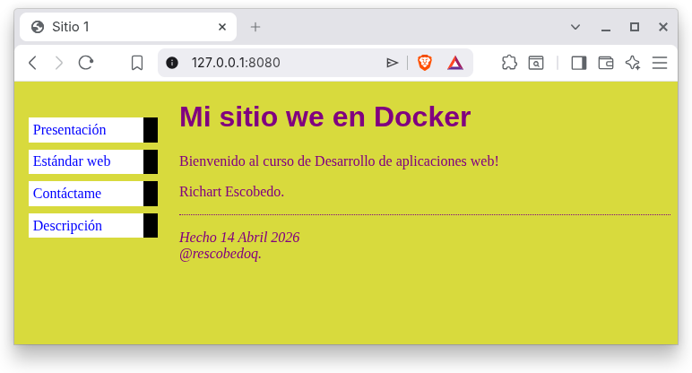
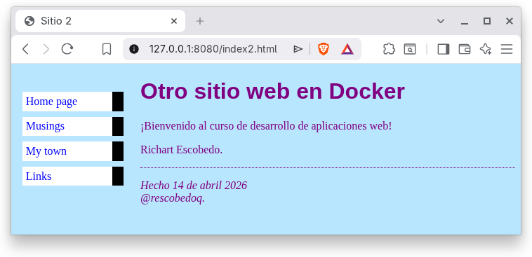

# Laboratorio 01: Docker
| Autores | Rol | Porcentaje |
| :--- | :--- | :---: |
| Richart Escobedo | Creación del archivo Dockerfile | 100% |
| Richart Escobedo | Elaboración del informe | 100% |
| | **Total** | **100%** |

| Entregables | URL |
| :--- | :--- |
| Repositorio | https://github.com/rescobedoq/daw.git |
| Laboratorio | https://github.com/rescobedoq/daw/tree/main/lab01 |
| Informe | https://github.com/rescobedoq/daw/blob/main/lab01/DAW_lab01.pdf |
| Video | https://youtu.be/1SThw3yJy9g |

# Descripción del Laboratorio
- Utilizar Docker para desplegar dos sitios web: **'/developers'** y **'/webapp'**.
- Configurar dos VirtualHosts en el servidor web Apache HTTP Server dentro de un contenedor Docker basado en Ubuntu 24.04.
- El VirtualHost **'/developers'** deberá ubicarse en el **DocumentRoot** **/webapps/daw/lab01/developers**.
- El VirtualHost **'/webapp'** deberá ubicarse en el **DocumentRoot** **/webapps/daw/lab01/webapp**.
- El VirtualHost para el sitio **'/developers'** mostrará:
-- [**index.html**] es la presentación del grupo (foto, actividades, hobbies, etc.).
-- [**webstandar.html**] (describirá un estándar web de la W3C).
-- [**contact.html**] (mostrará un formulario inoperante para contactar al grupo).
- El VirtualHost para el sitio **'/webapp'** mostrará la aplicación web desarrollada en el curso previo.
- Automatizar el despliegue de la tarea mediante un Dockerfile y aplicar todas las recomendaciones para crear la imagen y el contenedor.

# Entregables
- Informe de laboratorio en formato PDF a partir de una plantilla LaTeX (enviar en la tarea de Classroom). [DAW_lab01.pdf]
- URL pública de video de prueba de funcionamiento máx. 2 min. (Enviar sólo la URL en la tarea de Classroom). [DAW_lab01.mp4][^1]
- Repositorio de GitHub que contenga todo lo necesario para desplegar (la clonación y la revisión se harán en clase).

## Desplegar contenedor
```bash
docker build . -t i_daw_8080
```
```bash
docker run -d --name c_daw_8080 -p 8080:80 i_daw_8080
```
## Acceso a los sitios web
- Estos accesos corresponden al **DocumentRoot** por defecto del servidor web Apache HTTP Server 2.x (**/var/www/html**).
- El presente laboratorio requiere investigar cómo crear un VirtualHost en otras rutas. Ejemplo: **/webapps/daw/lab01/**.
```bash
http://127.0.0.1:8080/
```
```bash
http://127.0.0.1:8080/index2.html
```
```bash
http://10.7.46.185:8080/
```
```bash
http://10.7.46.185:8080/index2.html
```

## Detener contenedor, eliminar contenedor e imagen
```bash
docker stop c_daw_8080
```
```bash
docker rm c_daw_8080
```
```bash
docker rmi i_daw_8080
```

## Crear imagen con nombre diferente de Dockerfile
```bash
docker build -f Dockerfile2 . -t i_daw_8080
```

## Detener contenedor, eliminar contenedor e imagen
```bash
docker rm -f $(docker ps -aqf "name=^c_daw_8080$") && docker rmi i_daw_8080
```

## Pantallas
```bash
http://127.0.0.1:8080/developers
```

```bash
http://127.0.0.1:8080/webapp
```


## Rúbrica de calificación[^2]
| ítem | Descripción | Puntaje |
| :--- | :--- | :---: |
| **Informe** | El informe está completo, utiliza la plantilla y tiene un acabado impecable. (Debe estar en el repositorio Github y Classroom) | 5 |
| **Video** | El video es preciso y muestra la ejecución del contenedor en la terminal y la navegación por la aplicación web. (Video en Youtube. URL en Informe, Classroom y README.md) | 2 |
| **Github** | El repositorio contiene todos los archivos necesarios para el despliegue y muestra un orden y un manejo acordes con los estándares de codificación. | 10 |
| **README.md** | El laboratorio cuenta con un README.md necesario para desplegar la aplicación web. | 3 |
| **Prueba[^3]** | Se toman en cuenta todas las consideraciones y recomendaciones, lo que evidencia un trabajo en equipo. | -0 |
|  | **Total** | **20** |

[^1]: Si el docente solicita un video, debe cargarse en Youtube o Drive y sólo debe entregarse la URL pública, sin que se solicite login alguno. Es recomendable incluir la URL tanto en el README.md como en el informe y enviarlo a Classroom.
[^2]: La autocalificación es obligatoria.
[^3]: El docente debe comprobar el cumplimiento de todas las consideraciones y recomendaciones, evidenciando el trabajo en equipo con responsabilidad y la práctica de la ética profesional, a fin de no aplicar ninguna penalidad.

## Referencias
- https://www.w3.org/Style/Examples/011/firstcss.es.html
- https://www.w3schools.com/html/
- https://www.w3schools.com/css/
- https://www.w3schools.com/htmlcss/
- https://validator.w3.org/
- https://jigsaw.w3.org/css-validator/
