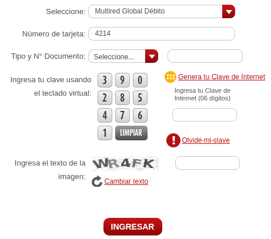
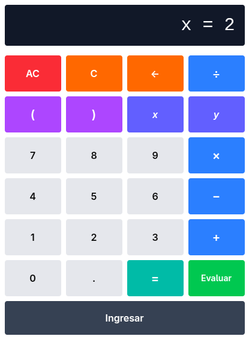
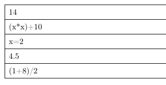
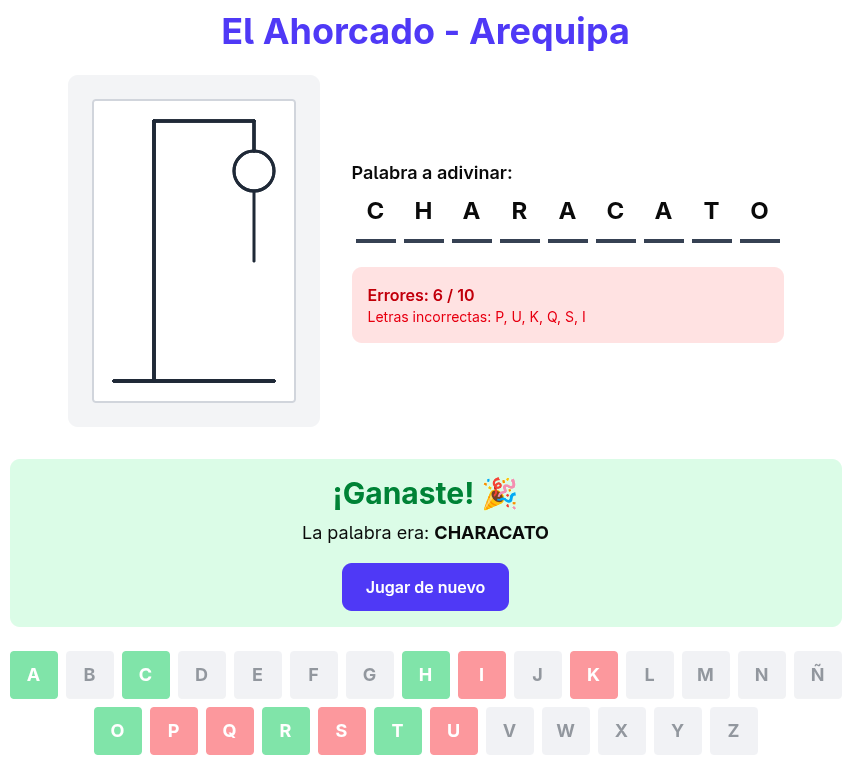

# Laboratorio 02: JavaScript (Frontend)
| Autores | Rol | Porcentaje |
| :--- | :--- | :---: |
| Richart Escobedo | Creación de los ejercicios JS | 100% |
| Richart Escobedo | Elaboración del informe | 100% |
| | **Total** | **100%** |

| Entregables | URL |
| :--- | :--- |
| Repositorio | https://github.com/rescobedoq/daw.git |
| Laboratorio | https://github.com/rescobedoq/daw/tree/main/lab02 |
| Informe | https://github.com/rescobedoq/daw/blob/main/lab01/DAW_lab02.pdf |
| Video | https://youtu.be/1SThw3yJy9 |

# Descripción del Laboratorio
- Implementar ejercicios utilizando JavaScript nativo.
- Utilizar Docker para desplegar dos sitios web: **'/lab02'**.
- Automatizar el despliegue de la tarea mediante un Dockerfile y aplicar todas las recomendaciones para crear la imagen y el contenedor.

# Entregables
- Informe de laboratorio en formato PDF a partir de una plantilla LaTeX (enviar en la tarea de Classroom). [DAW_lab02.pdf]
- URL pública de video de prueba de funcionamiento máx. 2 min. (Enviar sólo la URL en la tarea de Classroom). [DAW_lab02.mp4][^1]
- Repositorio de GitHub que contenga todo lo necesario para desplegar (la clonación y la revisión se harán en clase).

# Ejercicios
- Para los ejercicios, utilizar la siguiente plantilla, que no tiene etiquetas, dentro del documento html (en el **body** solo deben generarse elementos mediante JavaScript).
- Programar en JavaScript en una página web html básica.
```bash
<!DOCTYPE html>
<html lang="en">
<head>
    <meta charset="UTF-8">
    <meta name="viewport" content="width=device-width, initial-scale=1.0">
    <title>Document</title>
</head>
<body>
    <!-- no html, generate it with javascript -->
    <script src="ejercicio0N.js"></script>
</body>
</html>
```

## Ejercicio 01
- Generar el siguiente teclado.
```bash
http://127.0.0.1:8080/lab02/ejercicio01.html
```
- La generación del teclado debe ser aleatoria.


## Ejercicio 02
- Cree una calculadora básica, como la de los sistemas operativos, que utilice la función eval().
- Guarde todas las operaciones en una pila. Mostrar la pila al pie de la página web.
```bash
http://127.0.0.1:8080/lab02/ejercicio02.html
```



## Ejercicio 03
- Cree una versión del juego 'el ahorcado' que grafique con canvas, paso a paso, desde el evento onclick() en los botones.
```bash
http://127.0.0.1:8080/lab02/ejercicio02.html
```
- El juego incluye un botón "Iniciar Juego" que selecciona aleatoriamente una palabra arequipeña (como Pampacolca, Arequipa, Misti, Chachani, etc.). Al hacer clic en las letras, el canvas dibuja progresivamente las 10 partes del ahorcado: base, poste vertical, poste horizontal, cuerda, cabeza, cuerpo, brazos y piernas. El juego detecta automáticamente cuando ganas o pierdes.


## Desplegar contenedor
```bash
docker build . -t i_daw_8080
```
```bash
docker run -d --name c_daw_8080 -p 8080:80 i_daw_8080
```
## Acceso al laboratorio
```bash
http://127.0.0.1:8080/lab02
```

## Detener contenedor, eliminar contenedor e imagen
```bash
docker stop c_daw_8080
```
```bash
docker rm c_daw_8080
```
```bash
docker rmi i_daw_8080
```

## Crear imagen con nombre diferente de Dockerfile
```bash
docker build -f Dockerfile2 . -t i_daw_8080
```

## Detener contenedor, eliminar contenedor e imagen
```bash
docker rm -f $(docker ps -aqf "name=^c_daw_8080$") && docker rmi i_daw_8080
```

## Rúbrica de calificación[^2]
| ítem | Descripción | Puntaje |
| :--- | :--- | :---: |
| **Informe** | El informe está completo, utiliza la plantilla y tiene un acabado impecable. (Debe estar en el repositorio Github y Classroom) | 5 |
| **Video** | El video es preciso y muestra la ejecución del contenedor en la terminal y la navegación por la aplicación web. (Video en Youtube. URL en Informe, Classroom y README.md) | 2 |
| **Github** | El repositorio contiene todos los archivos necesarios para el despliegue y muestra un orden y un manejo acordes con los estándares de codificación. | 10 |
| **README.md** | El laboratorio cuenta con un README.md necesario para desplegar la aplicación web. | 3 |
| **Prueba[^3]** | Se toman en cuenta todas las consideraciones y recomendaciones, lo que evidencia un trabajo en equipo. | -0 |
|  | **Total** | **20** |

[^1]: Si el docente solicita un video, debe cargarse en Youtube o Drive y sólo debe entregarse la URL pública, sin que se solicite login alguno. Es recomendable incluir la URL tanto en el README.md como en el informe y enviarlo a Classroom.
[^2]: La autocalificación es obligatoria.
[^3]: El docente debe comprobar el cumplimiento de todas las consideraciones y recomendaciones, evidenciando el trabajo en equipo con responsabilidad y la práctica de la ética profesional, a fin de no aplicar ninguna penalidad.
