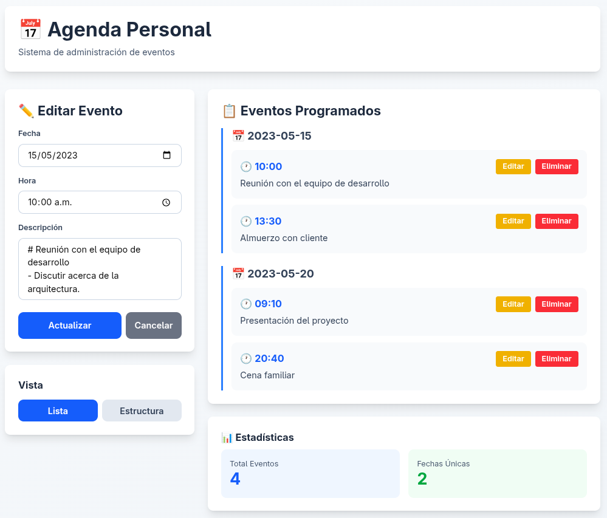

# Laboratorio 03: JavaScript (Backend)
| Autores | Rol | Porcentaje |
| :--- | :--- | :---: |
| Richart Escobedo | Creación de los ejercicios JS | 100% |
| Richart Escobedo | Elaboración del informe | 100% |
| | **Total** | **100%** |

| Entregables | URL |
| :--- | :--- |
| Repositorio | https://github.com/rescobedoq/daw.git |
| Laboratorio | https://github.com/rescobedoq/daw/tree/main/lab03 |
| Informe | https://github.com/rescobedoq/daw/blob/main/lab01/DAW_lab03.pdf |
| Video | https://youtu.be/1SThw3yJy9 |

# Descripción del Laboratorio
- Implementar una agenda con Node.js y Express.
- Las actividades deben guardarse como archivos de Markdown.
- Utilizar Docker para desplegar el sitio web: **'/lab03'**.
- Automatizar el despliegue de la tarea mediante un Dockerfile y aplicar todas las recomendaciones para crear la imagen y el contenedor.
> [!NOTE]
> ```diff
+ This line is green
- This line is red
```
> Utilizar la imagen de Docker y el servidor web de su preferencia (recomendación: Alpine, Alpaquita, Nginx, Lighttpd).

# Entregables
- Informe de laboratorio en formato PDF a partir de una plantilla LaTeX (enviar en la tarea de Classroom). [DAW_lab03.pdf]
- URL pública de video de prueba de funcionamiento máx. 2 min. (Enviar sólo la URL en la tarea de Classroom). [DAW_lab03.mp4][^1]
- Repositorio de GitHub que contenga todo lo necesario para desplegar (la clonación y la revisión se harán en clase).

# Descripción del laboratorio
- Crea una aplicación en Node.js con Express para administrar una agenda personal.
- Home (**"/"**) : Página Principal.
- Trabaje todo en una única interfaz.
- Ejemplo de estructura de la agenda al explorar **"Eventos"**.
```bash
agenda[DIR]
|
|---- 2023-05-15 [DIR]
      |---- 10-00.txt [FILE]
      |---- 13-30.txt [FILE]
|---- 2023-05-20 [DIR]
      |---- 09-10.txt [FILE]
      |---- 20-40.txt [FILE]
```

```bash
http://127.0.0.1:8080/lab03
```


## Desplegar contenedor
```bash
docker build . -t i_daw_8080
```
```bash
docker run -d --name c_daw_8080 -p 8080:80 i_daw_8080
```
## Acceso al índice del laboratorio
```bash
http://127.0.0.1:8080/lab03
```

## Detener contenedor, eliminar contenedor e imagen
```bash
docker stop c_daw_8080
```
```bash
docker rm c_daw_8080
```
```bash
docker rmi i_daw_8080
```

## Crear imagen con nombre diferente de Dockerfile
```bash
docker build -f Dockerfile2 . -t i_daw_8080
```

## Detener contenedor, eliminar contenedor e imagen
```bash
docker rm -f $(docker ps -aqf "name=^c_daw_8080$") && docker rmi i_daw_8080
```

## Rúbrica de calificación[^2]
| ítem | Descripción | Puntaje |
| :--- | :--- | :---: |
| **Informe** | El informe está completo, utiliza la plantilla y tiene un acabado impecable. (Debe estar en el repositorio Github y Classroom) | 3 |
| **Video** | El video es preciso y muestra la ejecución del contenedor en la terminal y la navegación por los ejercicios. (Video en Youtube. URL en Informe, Classroom y README.md) | 2 |
| **Crea evento** | El ejercicio está completo y contiene todas las recomendaciones. | 4 |
| **Lista eventos** | El ejercicio está completo y contiene todas las recomendaciones. | 3 |
| **Edita evento** | El ejercicio está completo y contiene todas las recomendaciones. | 3 |
| **Elimina evento** | El ejercicio está completo y contiene todas las recomendaciones. | 3 |
| **README.md** | El laboratorio cuenta con un README.md necesario para desplegar la aplicación web. | 2 |
| **Prueba[^3]** | Se toman en cuenta todas las consideraciones y recomendaciones, lo que evidencia un trabajo en equipo. | -0 |
|  | **Total** | **20** |

[^1]: Si el docente solicita un video, debe cargarse en Youtube o Drive y sólo debe entregarse la URL pública, sin que se solicite login alguno. Es recomendable incluir la URL tanto en el README.md como en el informe y enviarlo a Classroom.
[^2]: La autocalificación es obligatoria.
[^3]: El docente debe comprobar el cumplimiento de todas las consideraciones y recomendaciones, evidenciando el trabajo en equipo con responsabilidad y la práctica de la ética profesional, a fin de no aplicar ninguna penalidad.

## Referencias
- https://github.com/rescobedoq/backend-js.git
- [NodeJS   01   Instalacion   Ubuntu GNU Linux](https://youtu.be/dX1EFuQJEwI)
- [NodeJS   02   Ejercicio01   Hola Mundo](https://youtu.be/vEJ4GnkX81c)
- [NodeJS   05   Ejercicio04parte01   json](https://youtu.be/sUdE2Lw30pE)
- [NodeJS   06   Ejercicio04parte02   json html js](https://youtu.be/yBgJtu1GETA)
- https://nodejs.org/en
- https://expressjs.com/es/
- https://developer.mozilla.org/es/docs/Learn_web_development/Extensions/Server-side/Express_Nodejs/Introduction
- https://www.w3schools.com/nodejs/nodejs_express.asp
