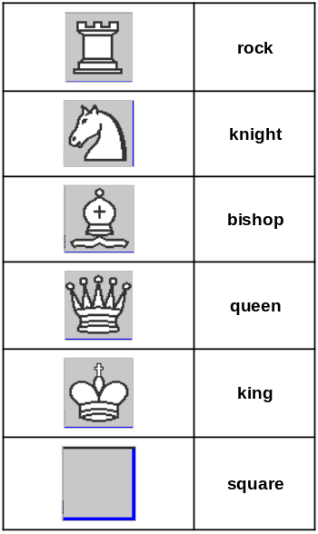
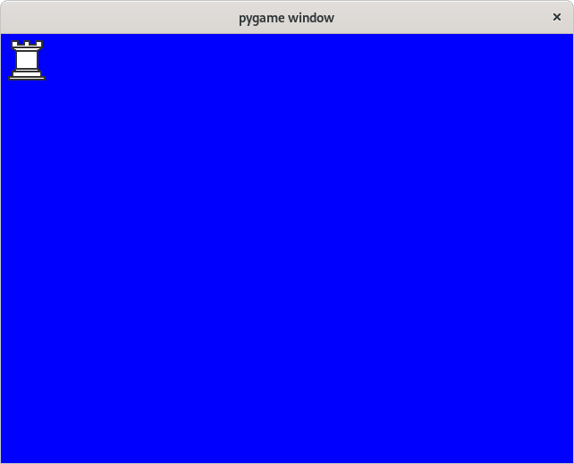
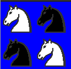
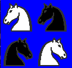
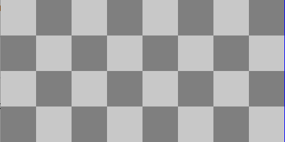
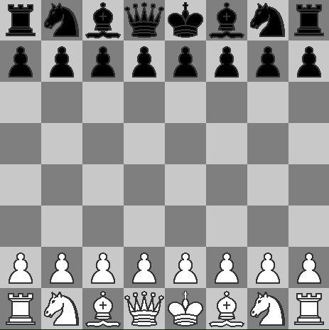
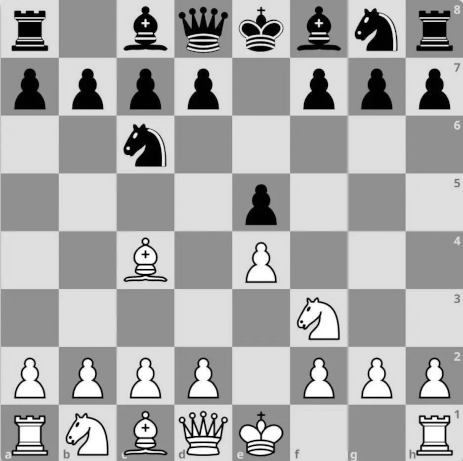
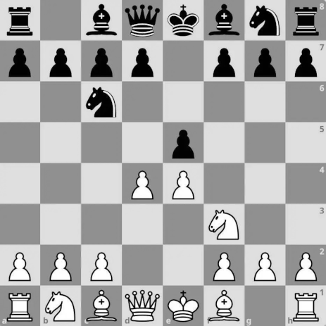

# Laboratorio 04 : Python
| Autores | Rol | Porcentaje |
| :--- | :--- | :---: |
| Richart Escobedo | Elaboración de ejercicios | 100% |
| Richart Escobedo | Elaboración del informe | 100% |
| | **Total** | **100%** |

| Entregables | URL |
| :--- | :--- |
| Repositorio | https://github.com/rescobedoq/daw.git |
| Laboratorio | https://github.com/rescobedoq/daw/tree/main/lab04 |
| Informe | https://github.com/rescobedoulasalle/daw/blob/main/lab06/DAW_lab04_python.pdf |

# Descripción de la práctica
- Crear virtual enviroment para trabajar con proyector Python. (requirements.txt)
- Programar usando Python.
- Mostrar un ejemplo de separación de intereses en clases: el modelo (lista de strings) de su vista (dibujo de gráficos).
- Elaborar informe.

# Ejercicios

- Dibujar un tablero de Ajedrez paso a paso.
- Utilice la parte gráfica que ya está programada.
- Sólo trabajar con las estructuras de datos subyacentes.
- Dispone de varios objetos de tipo **Picture** para poder realizar su tarea.



- Los objetos estan disponibles importando la biblioteca: **chessPictures**.
- Están internamente representados con arreglos de strings (**pieces.py**).
- La clase **Picture** tiene un sólo atributo: el arreglo de strings **img**, el cual contendrá la representación en caracteres de la figura que se desea dibujar.
- La clase **Picture** tiene una función implementada, debe implementar sus otras funciones.
- **_invColor**: recibe un color como un caracter de texto y devuelve su color negativo, también como texto.
- Revisar el archivo **colors.py** para conocer los valores negativos de cada caracter.
- La clase Picture cuenta con varios métodos que usted deberá implementar:
  - **verticalMirror**: Devuelve el espejo vertical de la imagen
  - **horizontalMirror**: Devuelve el espejo horizontal de la imagen
  - **negative**: Devuelve un negativo de la imagen
  - **join**: Devuelve una nueva figura poniendo la figura del argumento al lado derecho de la figura actual
  - **up**: Devuelve una nueva figura poniendo la figura recibida como argumento, encima de la figura actual
  - **under**: Devuelve una nueva figura poniendo la figura recibida como argumento, sobre la figura actual
  - **horizontalRepeat**: Devuelve una nueva figura repitiendo la figura actual al costado la cantidad de veces que indique el valor de n
  - **verticalRepeat**: Devuelve una nueva figura repitiendo la figura actual debajo, la cantidad de veces que indique el valor de n

- Para implementar todos estos métodos, sólo deberá trabajar sobre la representación interna de un Picture, es decir su atributo img.

-   Dibujar una objeto **Picture**.
-   Importar el método **draw** de la biblioteca **interpreter**.
    ```sh
    $ python3
    Python 3.9.2 (default, Feb 28 2021, 17:03:44) 
    [GCC 10.2.1 20210110] on linux
    Type "help", "copyright", "credits" or "license" for more information.
    ```
    ```sh
    >>> from chessPictures import *
    >>> from interpreter import draw
    pygame 1.9.6
    Hello from the pygame community. https://www.pygame.org/contribute.html
    >>> draw(rock)
    ```
    

- **Implemtar**:

    - Sólo usar ciclos, condicionales, definición de listas por comprensión, sublistas, map, join, (+), lambda, zip, append, pop, range.
    - Implemente los métodos de la clase **Picture**. (por etapas, probando realizar los dibujos que se muestran).
    - Usar los métodos de los objetos de la clase **Picture**
    - Dibujar las siguientes figuras (invoque a draw):

    (a) 

    (b) 

    (c) 

    (d) 

    (e) 

    (f) 

    (g) 

    (h) Movimientos básicos de la Apertura Italiana: 1.e4 e5 2.Cf3 Cc6 3.Ac4. Con 3.Ac4, las blancas desarrollan su alfil para presionar el peón de f7 y controlar el centro, creando posibles amenazas de ataque en el flanco de rey.
    
      
    (i) Movimientos básicos de la apertura escocesa: 1.e4 e5 2.Cf3 Cc6 3.d4. Con 3.d4, las blancas buscan abrir el centro y desafiar el control de las negras. Este movimiento permite un juego rápido y directo.
    
    
# Entregables
- Informe de práctica en PDF (enviar en la tarea de Classroom). [DAW_lab04_python.pdf]
- Repositorio de GitHub que contenga los archivos, anexos e imágenes de su investigación.

## Rúbrica de calificación[^1]
| ítem | Descripción | Puntaje |
| :--- | :--- | :---: |
| **Ejercicio a** | Explicación detallada paso a paso para implementar el ejercicio | 2 |
| **Ejercicio b** | Explicación detallada paso a paso para implementar el ejercicio | 2 |
| **Ejercicio c** | Explicación detallada paso a paso para implementar el ejercicio | 2 |
| **Ejercicio d** | Explicación detallada paso a paso para implementar el ejercicio | 2 |
| **Ejercicio e** | Explicación detallada paso a paso para implementar el ejercicio | 2 |
| **Ejercicio f** | Explicación detallada paso a paso para implementar el ejercicio | 2 |
| **Ejercicio g** | Explicación detallada paso a paso para implementar el ejercicio | 2 |
| **Ejercicio h** | Explicación detallada paso a paso para implementar el ejercicio | 3 |
| **Ejercicio i** | Explicación detallada paso a paso para implementar el ejercicio | 3 |
| **Video** | Demostración de uso de venv y ejecución de los ejercicios h e i.| -0 |
| **Prueba[^2]** | Se tomaron en cuenta todas las consideraciones y recomendaciones, lo que evidencia un trabajo en equipo. | -0 |
|  | **Total** | **20** |

Si el docente solicita un video, debe cargarse en Youtube o Drive y sólo debe entregarse la URL pública, sin que se solicite login alguno. Es recomendable incluir la URL tanto en el README.md como en el informe.

[^1]: La autocalificación es obligatoria.
[^2]: El docente debe comprobar el cumplimiento de todas las consideraciones y recomendaciones, evidenciando el trabajo en equipo con responsabilidad y la práctica de la ética profesional, a fin de no aplicar ninguna penalidad.

## Referencias
- https://www.w3schools.com/python/python_reference.asp
- https://docs.python.org/3/tutorial/
- https://virtualenv.pypa.io/en/latest/how-to/usage.html
- https://www.geeksforgeeks.org/python/python-pip/
- https://www.w3schools.com/python/python_lists.asp
- https://edwardo2013.github.io/CCOM_labs_python/LABS/ciclos.html
- https://www.w3schools.com/python/python_functions.asp
- https://www.w3schools.com/python/python_classes.asp
- https://www.geeksforgeeks.org/python/pygame-tutorial/
