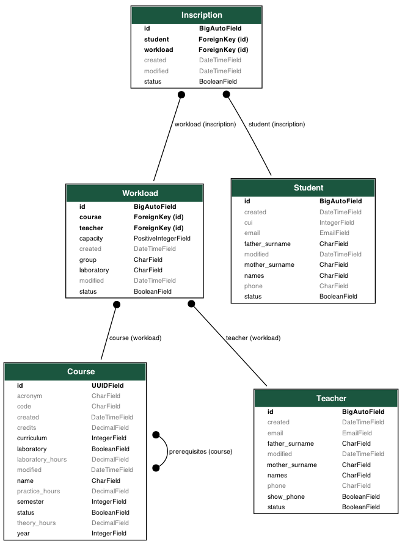

# Proyecto : enrollments

# Descripción de la aplicación web
- Se trata de una aplicación web para permitir a estudiantes incribirse en cursos determinados.

| Equipo | Rol | Porcentaje |
| :--- | :--- | :---: |
| Richart Escobedo | Desarrollador frontend | 100% |
| Richart Escobedo | Desarrollador backend | 100% |
| | **Total** | **100%** |

| Entregables | URL |
| :--- | :--- |
| Repositorio | https://github.com/rescobedoq/enrollments.git |
| **Informes** | |
|lab05 |https://github.com/rescobedoq/enrollments/blob/main/informes/DAW_lab05_bd.pdf|
|lab06 |https://github.com/rescobedoq/enrollments/blob/main/informes/DAW_lab06_admin.pdf|
|lab07 |https://github.com/rescobedoq/enrollments/blob/main/informes/DAW_lab07_vistas.pdf|
|lab08 |https://github.com/rescobedoq/enrollments/blob/main/informes/DAW_lab08_rest.pdf|
|lab09 |https://github.com/rescobedoq/enrollments/blob/main/informes/DAW_lab09_jwt.pdf|
|lab10 |https://github.com/rescobedoq/enrollments/blob/main/informes/DAW_lab10_frontend.pdf|
|lab11 |https://github.com/rescobedoq/enrollments/blob/main/informes/DAW_lab11_avance_proyecto.pdf|
|lab12 |https://github.com/rescobedoq/enrollments/blob/main/informes/DAW_lab12_proyecto_informe_final.pdf|

# Tecnología utilizada

| Ítem | Tecnología |
| :--- | :--- |
| **Desarrollo** | GNU/Linux |
| | Git |
| | Github |
| | Vim |
| **Frontend** | HTML5 |
| | CSS3 |
| | JavaScript |
| | TypeScript |
| | VueJS |
| **Backend** | Django |
| | Restframework |
| | JWT |
| **BD** | SQL |
| | Supabase |
| **Despliqgue** | Docker |
| | Netlify |
| | Vercel |
| | Render |
| | Railway |


# Modelo de Datos


# Estructura del proyecto
```bash
proyecto/
├── backend
│   ├── .gitignore
│   ├── README.md
│   └── requirements.txt
├── bd
│   ├── bd.sql
│   ├── .gitignore
│   └── README.md
├── frontend
│   ├── .gitignore
│   ├── package.json
│   └── README.md
├── .gitignore
├── informes
│   ├── DAW_lab05_bd.pdf
│   ├── DAW_lab06_admin
│   ├── DAW_lab07_vistas.pdf
│   ├── DAW_lab08_rest.pdf
│   ├── DAW_lab09_jwt.pdf
│   ├── DAW_lab10_frontend.pdf
│   ├── DAW_lab11_avance_proyecto.pdf
│   └── DAW_lab12_proyecto_informe_final.pdf
└── README.md
```

# Referencias
- https://www.netlify.com/
- https://vercel.com/
- https://render.com/
- https://railway.com/
